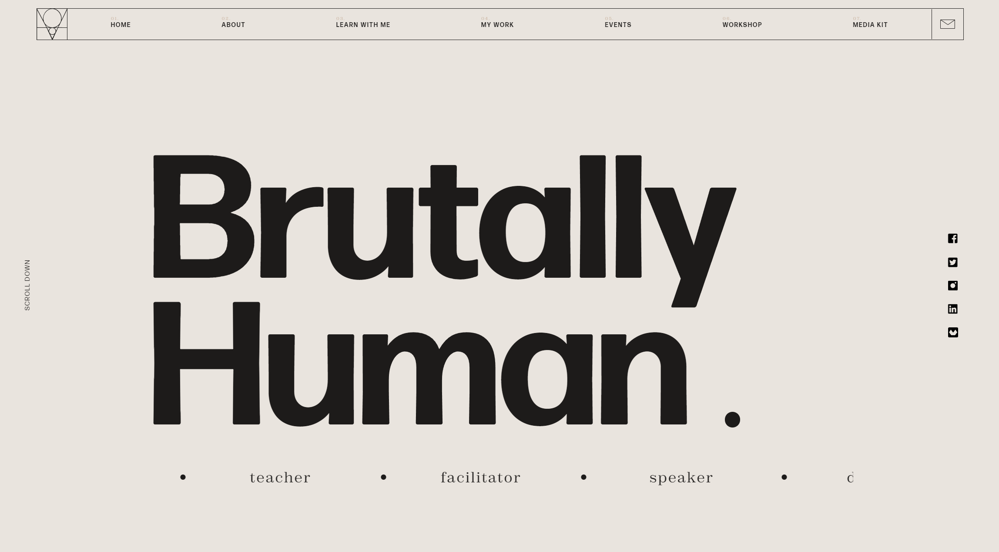
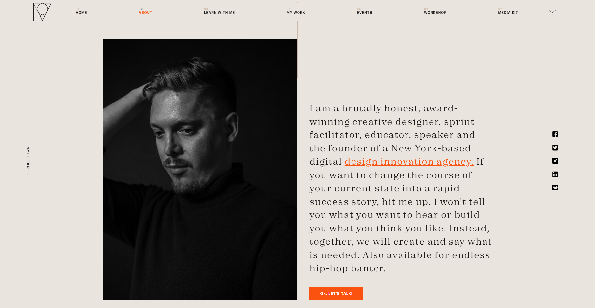
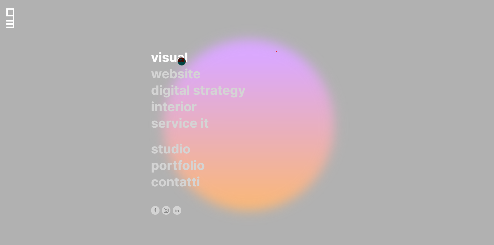
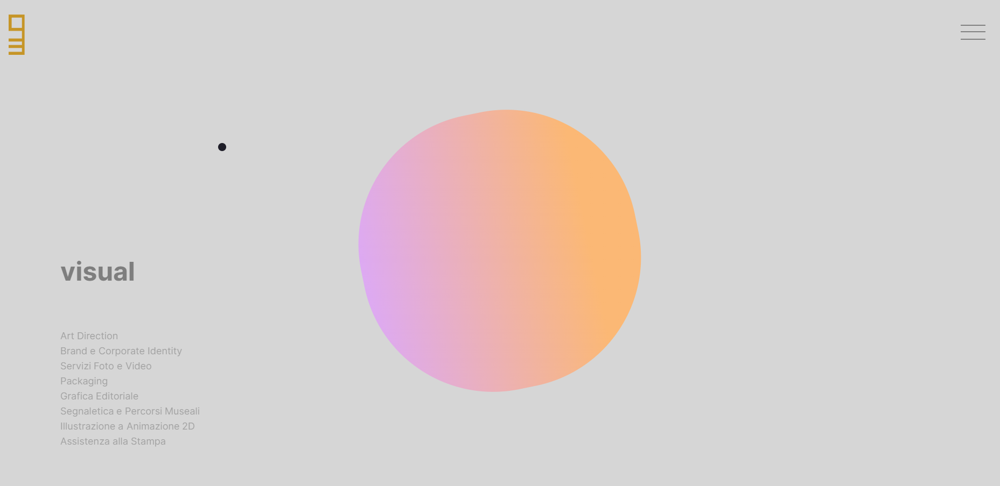
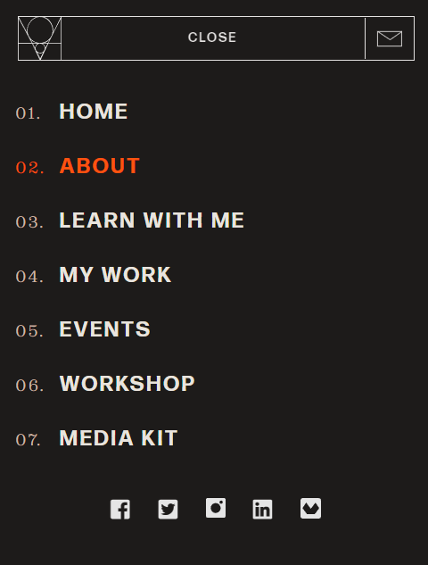

# Portfolio
Portfolio for Term 1

```
sass --style compressed --watch combined.scss:combined.css
```

- dot cursor or dot that follows cursor
- dot goes transparent over words
- words that blur when hovered over
- font size changing based on vw
- front page just name and a few words + cool design shit
- contact me form
- cool footer
- back to top button
- Pretty simple background, maybe beach themed, slightly opaque
- Grab an icon library
- Primary1 actually footer colour
- Remember to use sass to nest code within itself
- Create accent text mix in (em, span class=italics. strong, span class=bolded. a href class=accentlink)
- Create image default style
- Scrolled image bar near bottom of projects page
- links become accent text when hovered over


## **needs**
* front page (links to professional accounts)
* about me
* work/study history + resume
* list of blog posts
* 5 samples blog posts (one image each)

## media breakpoints
@media screen and (min-width: 600px)
@media screen and (min-width: 600px)
@media screen and (min-width: 600px)

### four components


neutral 2 bg
primary 2 links/accent
primary 1 text







